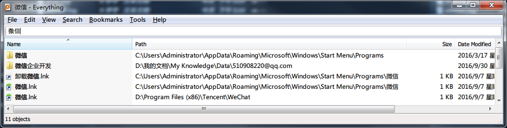
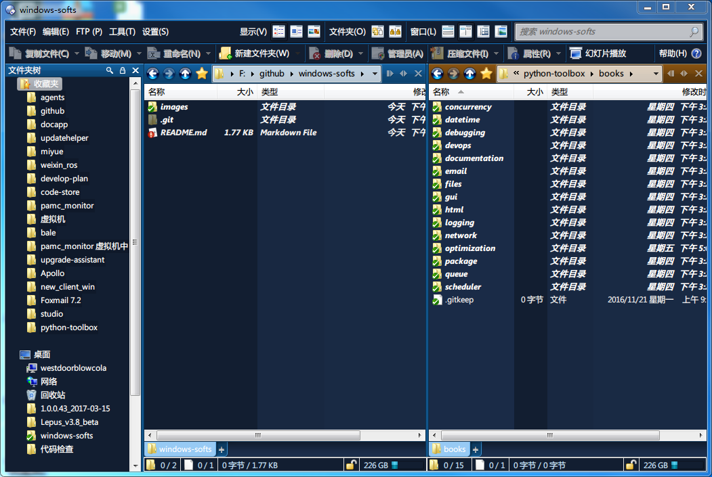

# windows-softs
整理一些windows下提高效率的软件.

## 快速启动

#### [Launchy](http://launchy.net/)

使用起来比较简单,  主要是搜索程序. 默认是快捷键`alt` + `空格`,如图:

比如我要打开微信,我可以输入`微信`,然后就会匹配到:

按下`enter`键即可打开`微信`

这样不仅可以让桌面很整洁,而且可以迅速的找到你想要的软件. 如果满足不了需求,可以考虑设置一些选项:
- 如果你安装的是绿色版的程序,就找不到你要的程序了. 这时可以在`目录`选项里加上对应的搜索目录
- 修改调出`Launchy`的快捷键,其他一些设置等
- 修改皮肤

#### [Wox](http://www.getwox.com/)

基本的使用根`Launchy`很像. 默认使用`alt`+`空格`调出. 如图:

还是输入`微信`,可以看到匹配到的信息:

可以看到匹配到信息比较长,程序快捷方式完整路径都列出来了.这一点感觉Launchy`做的好点. 不过`Wow`匹配到的信息比较多(应该是插件everything的搜索结果).如图:

如果从单纯的快速调出安装程序的话,感觉还是`launchy`好用,从功能上来说`Wow`更强. 实际看自己喜好了.

## 搜索工具

#### [Everything](http://www.voidtools.com/)
windows下的搜索神器. 如图,搜索一下`微信`:

可以看到可以搜索到任何与`微信`相关的东西. 另外一些高级功能:

- 正则表达式
- 书签
- 设置搜索文件类型,比如目录、可执行文件等等

## 资源管理器

> 在windows下成天跟目录打交道, 有没有觉得有时要找一个目录很麻烦呢

#### [Directory Opus](http://www.gpsoft.com.au/)

先看一下界面:

大概有这么几块:
- `文件夹树`: 这里是我平时会用到的一些目录,我收藏起来了,这样根据名字一下就跳到对应的目录了,这个功能很赞.
- 窗口设置,可以设置成水平双栏、垂直双栏,这样就多一个操作目录的视图区域了.
- 当前目录打开命令提示符. 整在输入一些命令很方便.
- 其他功能

